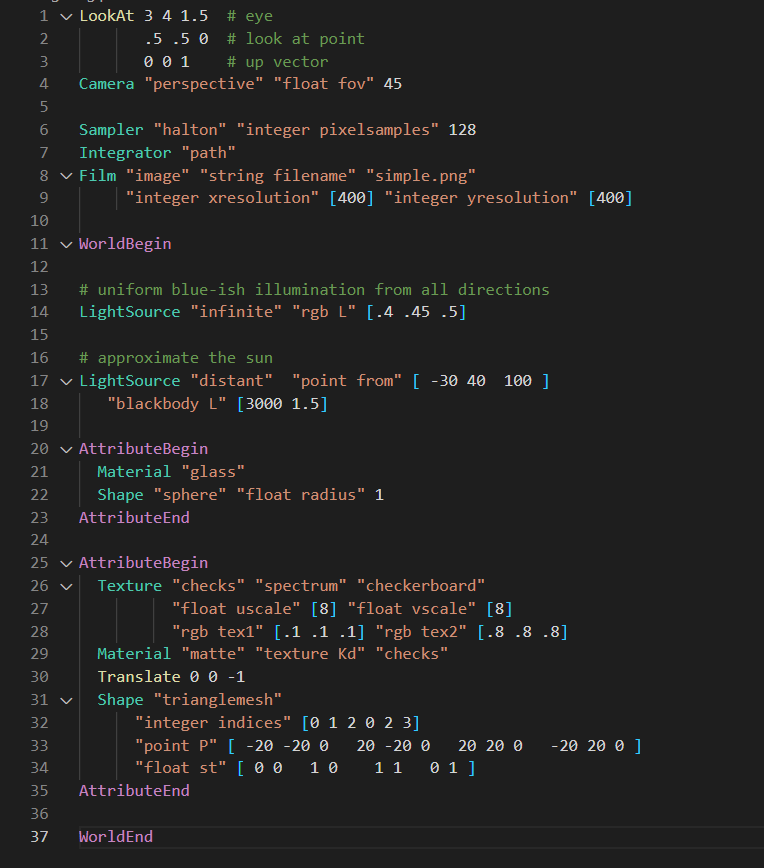

# pbrt-language-support README

## Features

Highlights keyword in the pbrt language

## Requirements

Only Visual Studio Code is required (for now :P)

## Known Issues

None for now

## Change Log

See [CHANGELOG.md](CHANGELOG.md)

## Feature wishlist

- Auto completion for the different keyword
